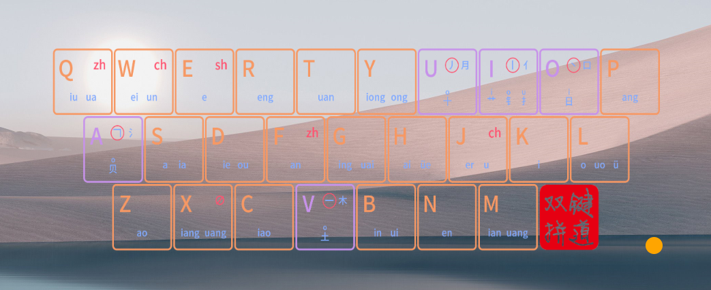

# Ont Input

## TODO

- [ ] 练手项目electron 辅助工具/打字游戏等，配合three.js
- [ ] 跨全平台安装包，如何实现
- [ ] [Rime_JD](https://github.com/xkinput/Rime_JD)如何实现的音形输入
  - [ ] 自制一个
- [ ] 增加rime-rice词库和搜狗词库以及智能AI词频
- [ ] 词频词库自动更新和跨端同步、多平台同步
- [ ] 增加五笔输入法

## Description

> 本项目是基于Rime的配置，主要是为了方便自己使用，也方便其他人使用，如果有任何问题，欢迎提issue。

## Features

键位辅助工具

<a href="#"></a>

## Installation

## Configration

### Windows

configuration path: `%APPDATA%\Rime`

### MacOS

```sh
brew install --cask squirrel
```
<!-- fcitx5-macos -->
configuration path: `~/Library/Rime`

### Linux

```sh
pacman -S ibus-rime
# sudo apt-get install ibus-rime # or fcitx-rime
# [fcitx-rime](https://github.com/fcitx/fcitx-rime)
# [fcitx5-rime](https://github.com/fcitx/fcitx5-rime)
```


configuration path: ``

### iOS

1. install Hamster

### Android

[trime](https://github.com/osfans/trime)
[fcitx5-android](https://github.com/fcitx5-android/fcitx5-android)
iOS: Hamster的RIME文件夹，将xmjd6-rere中所有文件覆盖进去即可
Android

### Vim支持

> [feat: vim_mode in app_options by fxliang · Pull Request #1047 · rime/weasel](https://github.com/rime/weasel/pull/1047) 已经解决了这个问题，只需要在配置文件中配置对应app的vim_mode选项值为true即可
> 旧版可以参考 [如何在Windows/Linux下的Rime使用Vim模式 - 知乎](https://zhuanlan.zhihu.com/p/654489636)

## 同步

> 同步需要注意，不要同步install.yaml和user.yaml，这两个文件是本地的配置文件，不同的电脑可能不一样，同步会导致配置文件冲突。
> build文件夹也不需要同步，这个文件夹是编译生成的，如果需要加入闭源的编译后的bin，则需要同步，如配置小鹤音形时。

### 参考

- [仓输入法 - ihsiao-软件开发技术分享](https://ihsiao.com/apps/hamster/)
- [iCloud同步教程](https://github.com/wzxmer/rime-txjx/blob/main/iCloud%E5%90%8C%E6%AD%A5%E6%95%99%E7%A8%8B.md)
- [amorphobia/rime-user-config: Rime 用户配置](https://github.com/amorphobia/rime-user-config)
- [popilong/ziyong](https://github.com/popilong/ziyong)
- [Attiv/jd6](https://github.com/Attiv/jd6)

## TODO

- [ ] xmjd-rere gitrebase + github action 优化
- [ ] 增加[雾凇拼音](https://dvel.me/posts/rime-ice/)
- [ ] 通过patch的方式合并各个需要的方案 [my-xmjd6-rere](https://github.com/JuckZ/xmjd6-rere)
- [ ] lua + AI
- [ ] 配置模块化 如针对vim的
- [ ] tools优化
- [ ] README.md,中文为主

- [-] 键盘双拼映射图，可以xx参考obs的[input-overlay](https://github.com/univrsal/input-overlay)或者参考打字练习部分所涉及的软件
- [-] 配置个人的小鹤音形和小鹤双拼
- [ ] linux尝试配置 iOS 配置 对比fcitx和ibus
- [ ] 密码管理工具
- [ ] 验证码工具
- [ ] 跨端输入，可以参考微信输入法
- [ ] AI（自托管）
  - [ ] 英文语法纠错
  - [ ] 自动补全支持
- [ ] 清理冗余文件、对当前文件以及其功能进行注释
  - [ ] 整理文件夹结构 区分系统 common等
  - [ ] 取消rime.lua
- [ ] 研究bin文件的生成
- [ ] [方案介绍：字海两分](https://xkinput.github.io/xxxk-help/#/schema-zhlf)结合
- [ ] 键道键位辅助软件
  - [ ] 增加预设的键位图
  - [ ] 多平台支持

## 键道6配置生成

```sh
git clone https://github.com/xkinput/Rime_JD
# 复制 rime 文件夹
# 复制 Tools\SystemTools\rime\Windows "Windows" 替换成目标系统的路径
# 复制 Tools\SystemTools\WindowsTools\用户数据 "WindowsTools" 替换成目标系统的路径，如果文件夹中是脚本，则阅读和执行
# 删除default.yam（暂时不删除）
```

## 方案

### 星猫键道

### 星空键道6

### one配置

整合了如下内容

https://github.com/ssnhd/rime

https://github.com/LufsX/rime

https://github.com/qujihan/Rime

### 小鹤音形

> 由于后期不再开源因此放弃该方案

- [小鹤音形配置](https://itx.ink/2018/11/21/SHARE_MY_RIME/)
- [入门 - 小鹤音形](https://suo.im/xh)
- [词库开源的小鹤音形 Rime 配方](https://github.com/amorphobia/openfly)

#### 配置参考

https://github.com/brglng/rime-xhup

#### 配置方法

下载官方[macOS版小鹤音形](http://ys-n.ysepan.com/116124318/319108762/j7427663656LGLTgUHjF81/%E5%B0%8F%E9%B9%A4%E9%9F%B3%E5%BD%A2%E2%80%9C%E9%BC%A0%E9%A1%BB%E7%AE%A1%E2%80%9Dfor%20macOS.zip?lx=xz)，解压后放到Rime的用户文件夹下，如果目录变更，则直接访问其[永硕网盘](http://flypy.ysepan.com/)下载。

## 打字练习

- [键魂](https://github.com/isPoto/KeySoul)
- [我爱打字网](https://www.52dazi.cn/home)
- [双拼练习 @ BlueSky](https://api.ihint.me/shuang/) 或者 手机<需复制到微信>：#小程序://双拼练习/S4NNm8kAAuu0L4C
- [😼打字规则 <新手项目>](https://hu0w1jn4xq.feishu.cn/docx/ZgQ8deGPlozhWCxOyeucBvHJnPe#doxcnBpagQmyH6jooxcqEGZgW8c)

## 词库管理

- [ ] 找到所有需要使用和维护的词库源地址
- [ ] 配置个人词库（AI、程序员、前后端）
  - [ ] 词库验证
  - [ ] 搜狗词库下载
  - [ ] 词库更新脚本
- [ ] 学习词库转码
  - [转码词库小工具](https://hu0w1jn4xq.feishu.cn/docx/ZgQ8deGPlozhWCxOyeucBvHJnPe#SqSideqego8YOKxozpZctNrmnrh)

下载并更新即可
https://github.com/iDvel/rime-ice/raw/main/opencc/emoji.txt
https://github.com/iDvel/rime-ice/raw/main/cn_dicts/8105.dict.yaml

两分词库，下载并解压http://cheonhyeong.com/File/ZHLF_rime_5.0.7z

## 更多脚本扩展

https://github.com/tswwe/my-rime-lua

## 学习资料

- [x] [星空输入法——键道6、一笔、两笔](https://xkinput.github.io/)
- [x] [研习键道 - Rime键道输入法](https://pingshunhuangalex.gitbook.io/rime-xkjd/learn-xkjd)
- [x] [小小星空](https://xkinput.github.io/xxxk-help/#/schema-xkjd6)
- [x] [简述全拼转小鹤转键道- 兼谈键道输入法的入门及优化包](https://zhuanlan.zhihu.com/p/607785939)
- [x] [键道 630](https://hu0w1jn4xq.feishu.cn/docx/doxcnjFlDmWbCPvBMkVQHJHRhOh)
- [x] [‌⁢​‍​​🐈「 星空键道 - 星猫版 」📋笔记 - 飞书云文档](https://hu0w1jn4xq.feishu.cn/docx/ZgQ8deGPlozhWCxOyeucBvHJnPe)
- [ ] [宇浩输入法](https://zhuyuhao.com/yuhao/)
- [ ] [86版极点五笔](https://github.com/KyleBing/rime-wubi86-jidian)
- [ ] [🍀四叶草输入法](https://www.fkxxyz.com/d/cloverpinyin/)
- [-] [小鹤音形编码查询](http://react.xhup.club/search)
- [x] [顶功与上屏方式 - 知乎](https://zhuanlan.zhihu.com/p/291029476)
- [x] [https://zhuanlan.zhihu.com/p/292605889](https://zhuanlan.zhihu.com/p/292605889)
- [ ] [其他资源](https://xkinput.github.io/xxxk-help/#/res)
- [ ] [Rime-dict](https://github.com/gshang2017/rime-dict)
- [ ] [Rime-sogou](https://github.com/gshang2017/docker/tree/master/rime-sogou)
- [ ] [scel2txt fork](https://github.com/liziqiang/scel2txt)
- [ ] [深蓝词库转换](https://github.com/studyzy/imewlconverter)
- [ ] [docker](https://github.com/gshang2017/docker)
- [ ] [Rime configuration](https://github.com/alswl/Rime)
  - [ ] [Makefile](https://github.com/alswl/Rime/blob/master/Makefile)

- https://github.com/LibreService/my_rime
- https://github.com/rime/rppi


## FAQ

IME和TSF

[高优先度接管输入事件导致 Chrome 快捷键失效 · Issue #997 · rime/weasel](https://github.com/rime/weasel/issues/997)

Q: 仓输入法如何自定义配置
A: [应用设置 · HonKit](https://ihsiao.com/apps/hamster/docs/AppSettings.html#%E5%A6%82%E4%BD%95%E4%BD%BF%E7%94%A8%E9%85%8D%E7%BD%AE%E6%96%87%E4%BB%B6)